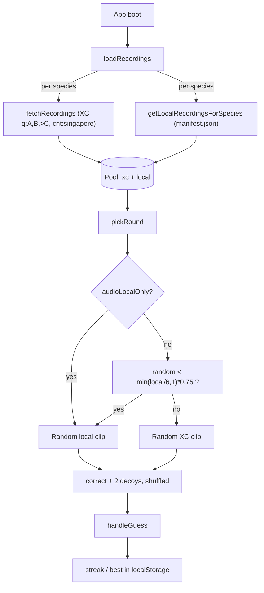

# BirdGuessr

A "guess the Singapore bird by its song" web game. Built with Vite + TypeScript + vanilla DOM, deployed to Netlify at <https://guessbirdbysong.netlify.app/>. Audio is mixed from local field recordings and the [Xeno-Canto](https://xeno-canto.org/) API; bird photos come from the NST Bird Race (2007–2026) iNaturalist project.

## Quickstart

```bash
npm install
cp .env.example .env          # then put your Xeno-Canto API key in VITE_XC_API_KEY
npm run dev
```

Open the URL Vite prints (usually <http://localhost:5173>).

---

## Deployment

The site has two runtime modes that handle the Xeno-Canto API key differently. Read both before deploying.

### Production (Netlify, auto-deploy from git)

Build settings are already declared in [`netlify.toml`](netlify.toml):

```toml
[build]
  command = "npm run build"
  publish = "dist"

[functions]
  directory = "netlify/functions"
```

So setup is:

1. **Connect the git repo** to a Netlify site. Netlify will auto-detect `netlify.toml` and won't ask for build/publish settings.
2. **Add one environment variable** under Site settings → Environment variables:
   - `XC_API_KEY` — your Xeno-Canto API key.
   - This is **not** prefixed with `VITE_`, because it is read server-side in [`netlify/functions/xc.mts`](netlify/functions/xc.mts) via `process.env.XC_API_KEY`. The browser never sees it.
3. **Push to the connected branch.** Netlify runs `npm run build` (which is `tsc && vite build`) and serves `dist/`.

In production the browser hits `/.netlify/functions/xc?query=...`, which the function forwards to Xeno-Canto with the secret key attached. See `xcApiUrl()` in [`src/api.ts`](src/api.ts) for the prod-vs-dev URL switch. Audio files themselves are loaded directly from `https://xeno-canto.org/<id>/download` (`xcAudioUrl()` in the same file) — no proxy needed for the audio bytes.

> **Note:** the OG/Twitter URL is hardcoded as `https://guessbirdbysong.netlify.app/` in [`index.html`](index.html). Update it if you deploy to a different domain.

### Local development

1. Copy [`.env.example`](.env.example) to `.env` and fill in `VITE_XC_API_KEY` with your key.
2. `npm run dev`.

In dev, Vite's proxy in [`vite.config.ts`](vite.config.ts) rewrites:

- `/api/xc` → `https://xeno-canto.org/api/3/recordings`
- `/audio/xc/<id>/download` → `https://xeno-canto.org/<id>/download`

The key travels from the browser as a `key=` query param (only the dev machine sees it; it never gets bundled into a public build). The Netlify Function is **not** used in dev.

Other scripts:

- `npm run build` — type-check then bundle to `dist/`.
- `npm run preview` — serve `dist/` locally. Note that the production build calls `/.netlify/functions/xc`, which only exists when running on Netlify. To test the production code path locally, install the Netlify CLI and use `netlify dev` instead of `npm run preview`.
- `npm run images:webp` — runs [`convert-images-to-webp.mjs`](convert-images-to-webp.mjs) to convert any `.jpg`/`.png` under `public/images/` into sibling `.webp`s. Requires the `cwebp` binary on `PATH`.

---

## How the game works

### Boot

On load, [`src/main.ts`](src/main.ts) calls `loadRecordings()` from [`src/game.ts`](src/game.ts), which builds a per-species pool from two sources in parallel:

- **Xeno-Canto pool** — `fetchRecordings()` in [`src/api.ts`](src/api.ts) queries `gen:<G>+sp:<S>+cnt:singapore` at quality `A` and `B` in parallel and dedupes by id. If the combined result has fewer than 8 recordings, it pulls quality `>C` as a fallback. Restricted-species rows whose `file` is redacted/empty are filtered out by `isXcRecordingPlayable()`. There is a single override in `resolveXcQuerySpecies()` that maps Cinnyris ornatus → Cinnyris jugularis at the XC layer (XC indexes them together).
- **Local pool** — `getLocalRecordingsForSpecies()` in [`src/localAudio.ts`](src/localAudio.ts) reads [`public/audio/local/manifest.json`](public/audio/local/manifest.json), keyed by the `<gen>-<sp>` lowercase slug, and turns each filename into a same-origin `/audio/local/<slug>/<file>` URL.

If a species ends up with **zero XC and zero local** clips, `loadRecordings()` throws and the loading screen surfaces a message naming the missing species and folder.

### Per-round selection

`pickRound()` → `pickRecordingFromPool()` in [`src/game.ts`](src/game.ts) decides which clip to play:

1. Pick a correct species uniformly at random from the 16 entries in `SPECIES`.
2. If the species' pool has only one source populated, use that one.
3. If the species has `audioLocalOnly: true`, always pick a local clip (no XC mixing).
4. Otherwise, mix XC and local with this rule:

   ```text
   localStrength = min(localCount / LOCAL_SATURATION_COUNT, 1)   // saturates at 6 local files
   localShare    = localStrength * (1 - XC_FLOOR)                // XC_FLOOR = 0.25
   useLocal      = Math.random() < localShare
   ```

   So XC always shows up at least 25% of the time, and local share saturates at 75% once a species has 6+ local files. The constants live at the top of [`src/game.ts`](src/game.ts) (`XC_FLOOR`, `LOCAL_SATURATION_COUNT`).

5. Build the choice list: `correct + 2 random decoys` from the other species, all shuffled.

### Round flow in the UI

`startRound()` and `handleGuess()` in [`src/main.ts`](src/main.ts):

- Set `audio.src` — for XC, `xcAudioUrl(id)` (proxied in dev, direct in prod); for local, the same-origin `/audio/local/...` path.
- Render the three choice buttons with reference photos.
- After a guess: show feedback, the correct species' image, and (XC only) the sonogram, location, recording date/time, and sound-type metadata. Local clips show a short "recorded by Jun Yu and Joshua" credit instead.
- Update the streak; persist best score to `localStorage` under `birdguessr-best`. On a new high score, open the share modal, which builds a URL with `challengeName` and `challengeScore` query params. Those are read back on a subsequent visit by `renderChallengeBannerFromLink()`.
- Track Birdopedia progress in `localStorage` under `birdguessr-achievements`: lifetime totals (`totalCorrect`, `totalWrong`) plus per-bird stats (`correctCount`, `attempts`, unlock state). Birdopedia shows global accuracy (`correct / attempts`) and per-bird accuracy (`correctCount / attempts`).



---

## Birdopedia

Birdopedia is the collection/progress page (top nav button), backed by localStorage and persisted across sessions.

- Top stats:
  - Lifetime correct IDs.
  - Accuracy (`totalCorrect / (totalCorrect + totalWrong)`), shown as a percentage.
  - Birds unlocked out of 16.
- 4x4 bird grid:
  - Locked bird: greyed thumbnail, hidden name (`???`), masked stats.
  - Unlocked bird: real name + thumbnail after first correct identification.
  - Per bird stats: `correctCount`, `attempts`, and accuracy (`correctCount / attempts`).
- Storage key:
  - `birdguessr-achievements` (JSON payload in `localStorage`).

---

## Adding a new bird

The species roster is hardcoded — a new bird needs a code entry, a photo, and at least one playable audio source.

### 1. Register the species

Add a line to the `SPECIES` array in [`src/game.ts`](src/game.ts):

```ts
bird("Pycnonotus", "jocosus", "Red-whiskered Bulbul"),
```

The signature is `bird(gen, sp, en, morePhotosUrl?, audioLocalOnly?)`:

- `gen` / `sp` — scientific name; case is preserved for display but lowercased for slugs.
- `en` — common name shown on the choice button.
- `morePhotosUrl` (optional) — gallery link (e.g. an iNaturalist taxon page) shown as "More photos" after a guess.
- `audioLocalOnly` (optional) — set to `true` to force local-only audio for this species (skip XC mixing entirely).

### 2. Add a hero photo

Drop a `.jpg` or `.png` at `public/images/birds/<gen-sp>.<ext>`, where `<gen-sp>` is the lowercase, hyphenated slug. The slug must match `speciesSlug()` in [`src/speciesMedia.ts`](src/speciesMedia.ts) — for the example above:

```text
public/images/birds/pycnonotus-jocosus.jpg
```

Then run `npm run images:webp` to produce the `.webp` that `defaultBirdImageSrc()` actually loads at runtime.

### 3. (Optional) Add an image credit

If you want a credit line under the photo, add an entry to `IMAGE_CREDIT_BY_SLUG` in [`src/speciesMedia.ts`](src/speciesMedia.ts), keyed by the same slug:

```ts
"pycnonotus-jocosus": {
  label: "Photo: NST Bird Race (2007–2026) on iNaturalist",
  sourceUrl: "https://www.inaturalist.org/observations/123456789",
},
```

Without an entry, no credit is rendered.

### 4. Make sure it has audio

The species needs **at least one** of these to exist, or `loadRecordings()` will throw at boot:

- **Xeno-Canto recordings.** Verify Singapore has hits for the species at `https://xeno-canto.org/explore?query=gen:<G>+sp:<S>+cnt:singapore`. If XC indexes the bird under a different scientific name (like Cinnyris ornatus → jugularis), add a case to `resolveXcQuerySpecies()` in [`src/api.ts`](src/api.ts).
- **Local audio files.** Drop `.wav` / `.mp3` files into `public/audio/local/<gen-sp>/` (same lowercase slug as the photo). Then **list each filename** in [`public/audio/local/manifest.json`](public/audio/local/manifest.json):

  ```json
  "pycnonotus-jocosus": [
    "song 1.wav",
    "song 2.wav"
  ]
  ```

  The manifest is the single source of truth — files on disk that are not listed are ignored. Filenames must match exactly (spaces are fine).

  If XC has nothing usable for the species, also pass `audioLocalOnly: true` to the `bird(...)` entry from step 1, so the round picker won't try to mix XC clips that don't exist.

### 5. Verify

Run `npm run dev`. If anything is missing for the new species, `loadRecordings()` throws a message naming the species and the expected folder, and the loading screen displays it. Otherwise the new bird will start appearing in random rounds.

---

## Project layout

```text
.
├── index.html                       # App shell, OG metadata, all DOM IDs the JS hooks into
├── netlify.toml                     # Netlify build + functions config
├── vite.config.ts                   # Dev-only XC proxy (/api/xc, /audio/xc)
├── convert-images-to-webp.mjs       # `npm run images:webp` helper (cwebp wrapper)
├── netlify/
│   └── functions/
│       └── xc.mts                   # Server-side XC proxy used in production
├── public/
│   ├── audio/local/                 # Field recordings, one folder per species slug
│   │   └── manifest.json            # Source of truth for which local files are loaded
│   └── images/birds/                # <gen-sp>.webp hero photos
└── src/
    ├── main.ts                      # DOM wiring, audio player, share modal
    ├── game.ts                      # SPECIES list, pool loading, round picker, mix policy
    ├── api.ts                       # Xeno-Canto fetch + dev/prod URL switch
    ├── localAudio.ts                # Manifest reader for local clips
    ├── speciesMedia.ts              # Image slug + credit table
    ├── types.ts                     # Recording / Species / GameState types
    └── style.css                    # Single stylesheet
```

---

## Credits

- **Bird audio** — [Xeno-Canto](https://xeno-canto.org/) contributors (per-recording credit shown after each round) plus local field recordings by Jun Yu and Joshua.
- **Bird photos** — [NST Bird Race (2007–2026)](https://www.inaturalist.org/projects/nst2007-2026-bird-race) on iNaturalist.
